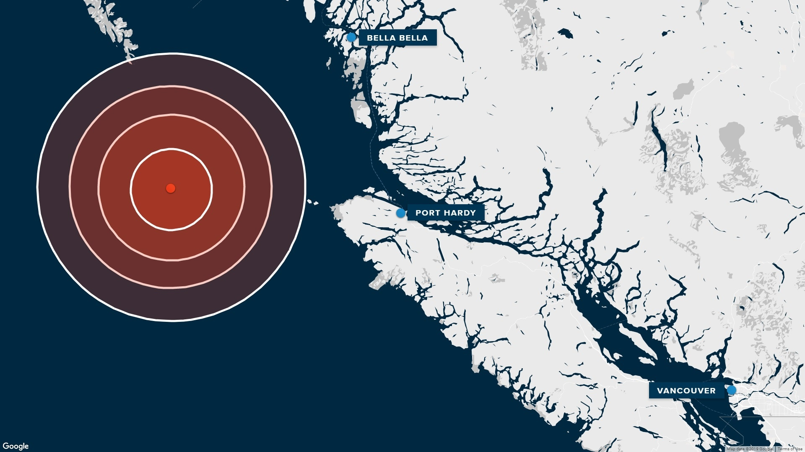
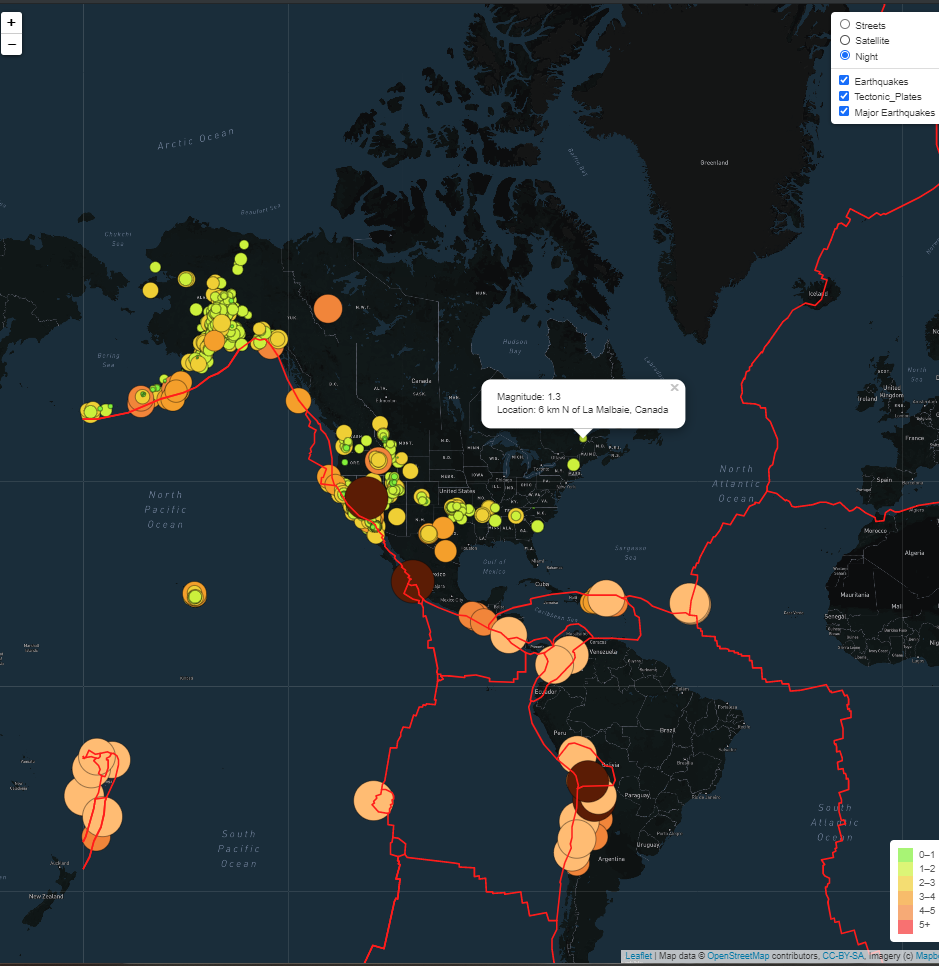

# Mapping_Earthquakes

Creating interactive maps using GeoJSON data, to explore earthquakes around the world. 

## Resources
### Data
- Toronto Air Routes - torontoRoutes.json
- Toronto Neighborhoods - torontoNeighborhoods.json
- World Major Airports - majorAirports.json
- Tectonic Plate Lines - [gitHub repository](https://github.com/fraxen/tectonicplates)
- USGS Earthquake hazards Program - [USGS data](https://earthquake.usgs.gov/earthquakes/feed/v1.0/geojson.php)

### Tools
- VS Code v1.51.1
- Google Chrome 86
- MapBox and Leaflet
- JavaScript, HTML & CSS

## Result 
